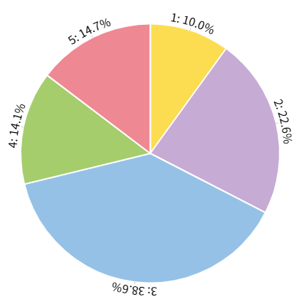

# 5Hanayome Twitter Users Analysis

[Live Demo](https://miksin.github.io/5hanayome-twitter-user-analysis)

An analysis of followers of 五等分の花嫁 twitter official account [@5Hanayome](https://twitter.com/5Hanayome)
through a interactive visualization tool.

> Data collected on 2019-11-16 through [Twitter API](https://developer.twitter.com/en/docs/api-reference-index).

## Information



- fans among 5 sisters
- mentioned keywords from timelines
- locations of followers

## Project setup

```bash
yarn install
yarn run generate:data
```

### Compiles and hot-reloads for development

```bash
yarn run serve
```

### Compiles and minifies for production

```bash
yarn run build
```

## Charts Library

- [Chart.js](https://www.chartjs.org/) / [vue-chartjs](https://vue-chartjs.org/)
- [amCharts](https://www.amcharts.com/)
